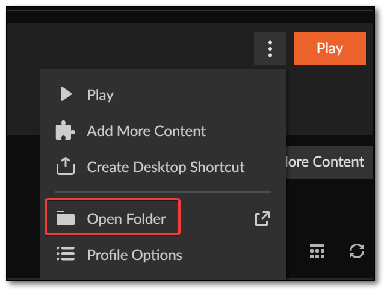

# Minecraft

General setup:

* I like running [curseforge](https://www.curseforge.com/) for running different versions and extensions
* [Optifine](https://optifine.net/home) to make it a lot prettier!
  * Click the three dots, then Open Folder

<figure><figcaption></figcaption></figure>

* Copy that path, and after you download Optifine into the MODS subfolder
* In curseforge, add shaders (I'm currently using 'ComplementaryReimagined')
* Add any other mods
  * Xaero's Minimap
  * Tree Harvester
  * Clumps
* Then within minecraft set up optifine (enable it, and check performance settings)

