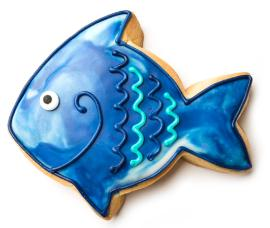

# Phishing Replies

At work if anyone reports a phishing email, I receive it. I like to put funny replies back to make them smile and make people more likely to report weird emails. I don't mind if someone reports what they _thought_ was a weird email, but was just spam or similar, and not phishing. Here are my replies - please feel free to use them yourself

All my emails follow the same outline:

_\[Name],_

_\[One of the options from below]_

Please continue to report any other phishing emails you receive and remember it is better to pause and think, than click and be wrong.

Xoke

Supreme Ruler of Awesomeness

Company

***

Alert! You’ve activated the Alien Intrusion Alarm and stopped a cosmic-level phishing attempt 👽

Disclaimer: Alarm does not notify actual aliens. Any resemblance to Area 51 protocols is purely coincidental.

***

Hooray! You’ve received the Cyber Astronaut’s Helmet for launching that phishing email into space.

<figure><figcaption></figcaption></figure>

_Disclaimer: This helmet does not provide actual space travel capabilities. It won't help you visit the moon or communicate with aliens. Use your helmet wisely!_

***

Cheers, Mate! You’ve received the Aussie BBQ Master’s Tongs for grilling that phishing email. 🍖

Disclaimer: These tongs do not grant actual BBQ skills. They won’t help you cook the perfect steak or host a backyard BBQ. Use your tongs wisely!

***

Good catch! Thanks for reporting the phishing email, Bill Murray has a message for you.

<figure><figcaption></figcaption></figure>

_Disclaimer: Not an actual endorsement from Bill Murray and cannot be used in annual review for more money_

***

G'day! You’ve unlocked the Outback Explorer’s Boomerang for catching that phishing email.

.png>)

Disclaimer: This boomerang does not grant actual boomerang-throwing skills. It won’t help you catch kangaroos or navigate the outback. Use your boomerang wisely!

***

Cheers! You've been awarded the Cyber Celtic Knot of Wisdom for thwarting that phishing attempt.

.png>)

Disclaimer: This knot does not grant ancient druidic knowledge or the ability to speak Gaelic. It excels only in digital wisdom.

***

Cheers! You've been awarded the Cyber Bartender's Cocktail for mixing up that phishing email.

<figure><figcaption></figcaption></figure>

_Disclaimer: This cocktail does not contain real alcohol. It won't help you become a mixologist or host a party. Enjoy your drink responsibly!_

***

Good catch! Thanks for reporting the phishing email, have a cookie

<figure><figcaption></figcaption></figure>

_Disclaimer: Cookie has no monetary value. Void where prohibited by law. One cookie per phishing email per user. Email processed in a facility that contains nuts. Not a source of fiber unless printed out and eaten. Do not eat_

***

Good catch! Thanks for reporting the phishing email, have a cookie

Disclaimer: Cookie has no monetary value. Void where prohibited by law. One cookie per phishing email per user. Email processed in a facility that contains nuts. Not a source of fiber unless printed out and eaten. Do not eat

***

Crikey! You’ve earned the Crocodile Hunter’s Hat for wrestling that phishing attempt. 🐊

.png>)

Disclaimer: This hat does not grant actual crocodile-wrestling skills. It won’t help you tame wild animals or survive in the bush. Use your hat wisely!

***

Crikey! You’ve earned the Crocodile Hunter’s Hat for wrestling that phishing attempt. 🐊

 (1).png>)

Disclaimer: This hat does not grant actual crocodile-wrestling skills. It won’t help you tame wild animals or survive in the bush. Use your hat wisely!

***

Eureka! You’ve discovered the Cyber Archaeologist’s Shovel for digging up that phishing email.

>)

Disclaimer: This shovel does not grant actual archaeological skills. It won’t help you find ancient ruins or decipher hieroglyphics. Use your shovel wisely!

***

Cheers! You’ve been awarded the Cyber Artist’s Palette for painting a defense against that phishing scam.

>)

Disclaimer: This palette does not grant actual artistic skills. It won’t help you create a masterpiece or become a famous artist. Use your palette wisely!

***

Bravo! You’ve unlocked the Cyber Chef’s Golden Spatula for cooking up a defense against that phishing email.

>)

Disclaimer: This spatula does not grant actual culinary skills. It won’t help you make a gourmet meal or win a cooking show. Use your spatula wisely!

***

Congratulations! You’ve received the Cyber Explorer’s Compass for navigating through that phishing email.

>)

Disclaimer: This compass does not grant actual navigation skills. It won’t help you find hidden treasures or navigate through jungles. Use your compass wisely!

***

Hooray! You’ve earned the Cyber Gardener’s Green Thumb for weeding out that phishing attempt.

>)

Disclaimer: This green thumb does not grant actual gardening skills. It won’t help you grow a lush garden or talk to plants. Use your green thumb wisely!

***

Whoa there, Cyber Wrangler! You’ve lassoed a phishing attempt like a true digital cowboy 🤠

>)

Disclaimer: Horse not included. This award does not grant ranching privileges or access to secure Wi-Fi in the Wild West.

***

Kudos! You’ve unlocked the Cybersecurity Gardener’s Badge for weeding out that phishing email.

>)

Disclaimer: This badge does not improve your gardening skills or grant a green thumb. It excels only in digital horticulture.

***

Good catch! You’ve earned the Sherlock Holmes Detective Badge for spotting that phishing email.

<figure><figcaption></figcaption></figure>

_Disclaimer: Remember, this badge grants no actual detective powers. It won’t help you find lost socks or solve complex mysteries. Use it wisely!_

***

Bravo! You've unlocked the Cyber Detective's Magnifying Glass for uncovering that phishing attempt.

<figure><figcaption></figcaption></figure>

_Disclaimer: This magnifying glass does not enhance your detective skills. It won't help you solve mysteries or find lost items. Use your sleuthing wisely!_

***

Good catch! You've unlocked the Cybersecurity Duck of Wisdom. Â Quack responsibly!

<figure><figcaption></figcaption></figure>

_Disclaimer: Duck is not a licensed financial advisor, therapist, or life coach. It excels only in rubbery wisdom_

***

Boom! You’ve earned the Exploding Firewall Trophy for stopping that suspicious link in its tracks 💥

>)

Disclaimer: This trophy does not come with actual explosive capabilities. Please do not attempt to detonate your router. Confetti not included.

***

Greetings, Earthling! You’ve been awarded the Galactic Defender Badge for thwarting that phishing attempt

<figure><figcaption></figcaption></figure>

_Disclaimer: This badge does not grant interstellar travel privileges or the ability to communicate with extraterrestrials. Any spelling errors are due to translation from galactic standard and not due to using AI to create image_

***

Bonza! You’ve discovered the Great Barrier Reef Diver’s Mask for diving into that phishing email. 🐠

.png>)

Disclaimer: This mask does not grant actual diving skills. It won’t help you explore the Great Barrier Reef or swim with fish. Use your mask wisely!

***

Huzzah! You’ve earned the Medieval Knight’s Shield for defending against that phishing attack.

<figure><figcaption></figcaption></figure>

Disclaimer: This shield offers no real protection against dragons or malware. It’s purely for your digital valor!

***

Strewth! You’ve been awarded the Koala’s Cuddly Award for spotting that phishing scam. 🐨

.png>)

Disclaimer: This award does not grant actual koala-cuddling skills. It won’t help you climb trees or eat eucalyptus leaves. Use your cuddly award wisely!

***

Bravo! You’ve unlocked the Cyber Ninja Stealth Award for catching that phishing email.

<figure><figcaption></figcaption></figure>

Disclaimer: This award does not grant actual ninja skills. It won’t help you sneak past your boss or disappear during meetings. Use your stealth wisely!

***

Good catch! You're now an honorary member of the Phish Avengers. Your superpower? Spotting fishy emails!

<figure><figcaption></figcaption></figure>

_Disclaimer: Cape doesn't grant flight, invisibility, or immunity to awkward social situations_

***

Ahoy, matey! You've discovered the Phishing Pirate's Treasure Map. X marks the spot where you found that sneaky email

<figure><figcaption></figcaption></figure>

_Disclaimer: Map leads only to imaginary treasure chests filled with digital doubloons_

***

Ahoy, Matey! You've unlocked the Pirate's Parrot Award for spotting that phishing scam. 🦜 Avast ye!

 (1).jpg>)

Disclaimer: This parrot does not grant the ability to speak pirate or find buried treasure. It excels only in squawking wisdom.

***

Cheers! You've been awarded the Digital Pirate's Treasure for spotting that phishing email.

<figure><figcaption></figcaption></figure>

_Disclaimer: This treasure does not include real gold, jewels, or pirate ships. It's purely for your digital vigilance._

***

Ahoy, Matey! You’ve earned the Pirate’s Treasure Chest for capturing that phishing scam. 🏴‍☠️

 (1).jpg>)

Disclaimer: This treasure chest does not contain real gold or doubloons. It won’t help you buy a pirate ship or find buried treasure. Use your loot wisely!

***

Bravo! You've unlocked the Cyber Samurai Honor for defending against that phishing attack.

<figure><figcaption></figcaption></figure>

_Disclaimer: This honor does not grant actual samurai skills or katana-wielding abilities. Use your digital sword wisely!_

***

Eureka! You've discovered the Cybersecurity Scientist's Flask for identifying that phishing email.

<figure><figcaption></figcaption></figure>

_Disclaimer: This flask contains no actual scientific breakthroughs. It won't help you create a potion for infinite coffee or solve complex equations. Use your discoveries wisely!_

***

Congratulations! You’ve unlocked the Ancient Scroll of Cyber Wisdom for reporting that shady email 📜

>)

Disclaimer: Scroll may not be accepted by actual wizards or IT auditors. Reading it aloud will not summon tech support.

***

Good catch! Thanks for reporting the phishing email, have a gold star

<figure><figcaption></figcaption></figure>

_Disclaimer: Star has no monetary value. Void where prohibited by law. One star per phishing email per user. Do not print out, staple to your collar, and pretend you are a General_

***

Congratulations! You've earned the Cybersecurity Unicorn Horn for your vigilance. Stay magical!

<figure><figcaption></figcaption></figure>

_Disclaimer: This unicorn horn does not grant actual magical powers or the ability to summon rainbows. It excels only in mythical wisdom._

***

Congratulations! You've been granted the Wizard's Spellbook for dispelling that phishing email.

<figure><figcaption></figcaption></figure>

Disclaimer: (This spellbook contains no real magic. It won't help you turn your boss into a frog or make your coffee refill itself. Use your spells wisely!)

***
